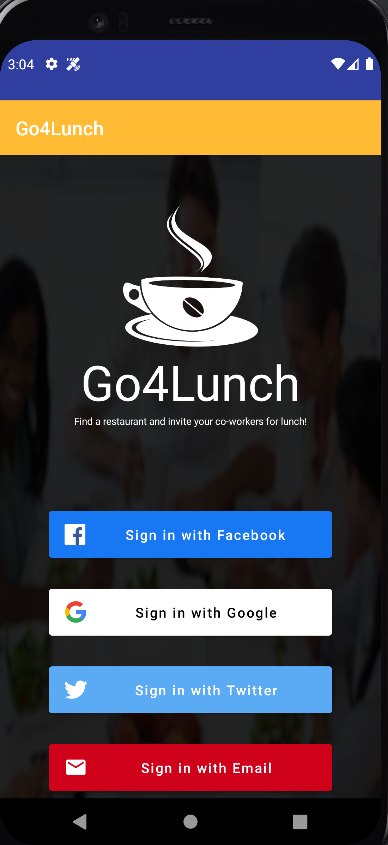
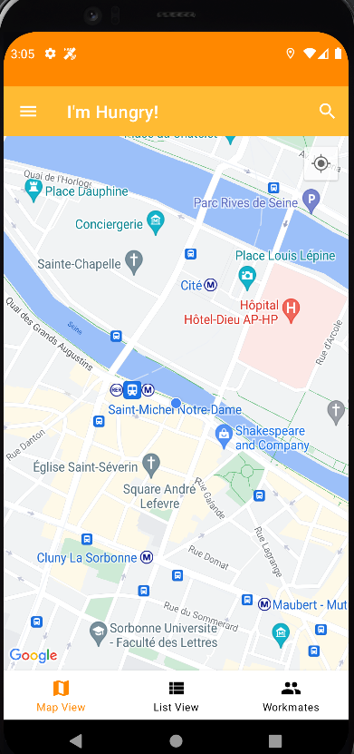
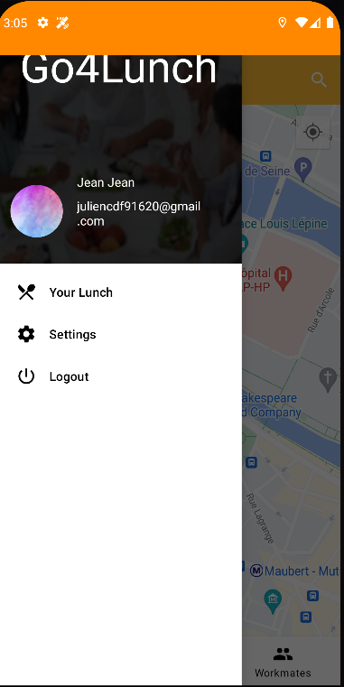
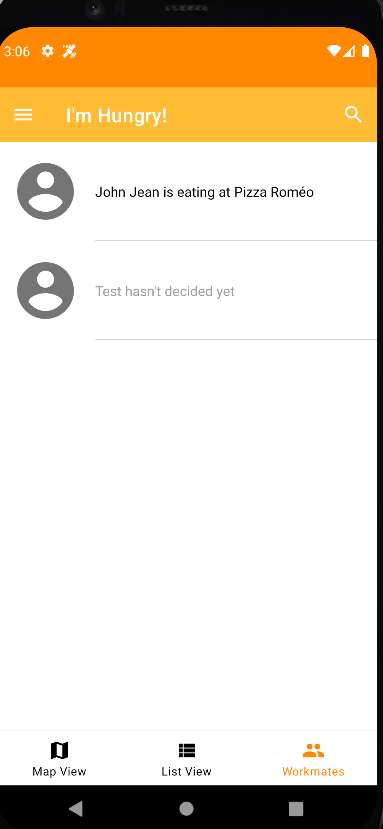

# Go4Lunch
An Android App to find a place to eat with your coworker. You can

- visualize all the place to eat on a map and on a list
- display the detail of a restaurant and find if someone is eating here
- know where your coworker are eating if they choosed a restaurant
- choose a restaurant to lunch
- get a notification to remember you where you choose to eat

## Display
&ensp;

## App Architecture
* MVVM
* Java
* databinding

## Library
* [Androidx Library](https://developer.android.com/jetpack/androidx)
* [Glide](https://github.com/bumptech/glide/)
* [Gson](https://github.com/google/gson/)
* [RobotElectric](https://github.com/robolectric/robolectric)
* [Easy Permissions](https://github.com/googlesamples/easypermissions)
* [Espresso](https://developer.android.com/training/testing/espresso)
* [Cloud Firestore](https://firebase.google.com/docs/firestore)
* [Firebase Authentification](https://firebase.google.com/docs/auth)
* [Facebook Android SDK](https://developers.facebook.com/docs/android/)
* [Twitter Android SDK](https://developer.twitter.com/en/docs/developer-utilities/twitter-libraries)
* [Retrofit](https://square.github.io/retrofit/)
* [Maps Android SDK](https://developers.google.com/maps/documentation/android-sdk/intro)
* [Place Android SDK](https://developers.google.com/places/android-sdk/intro)
* [Ok Http](https://square.github.io/okhttp/)

## API
* [Google Maps API](https://maps.googleapis.com)
